# CREATE AWS EC2 (Linux VM) AND USE PUTTY TO ACCESS IT

Belows are steps demonstrating how to create EC2 (Virtual Machine-Linux VM) and later access the EC2 using Putty :

<b>Part 1 : Create Instance in EC2<b>

Name the EC2 Instance :  
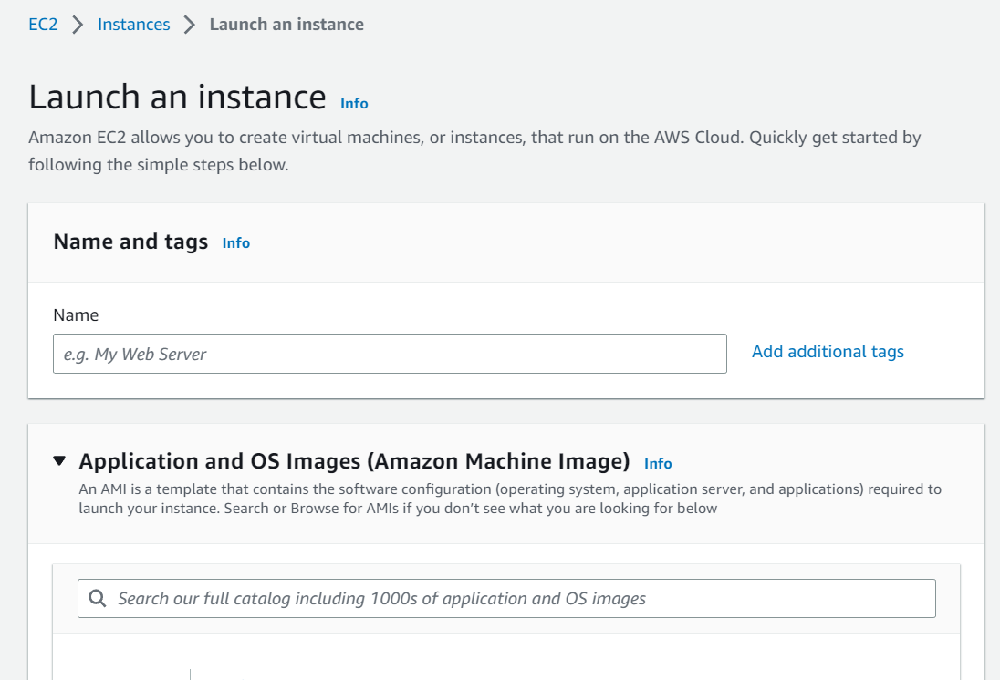

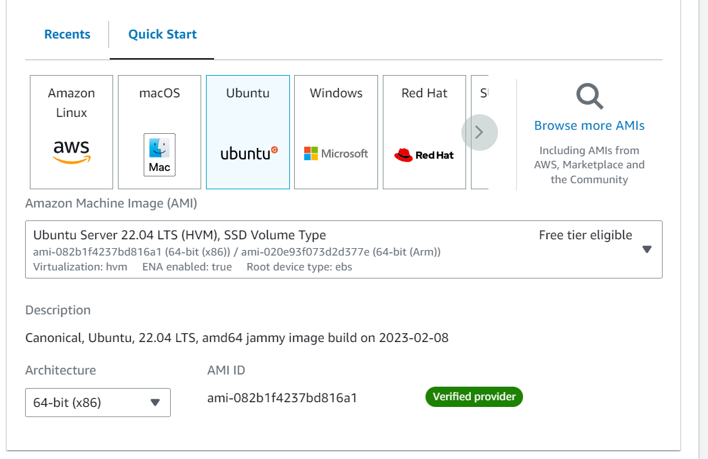

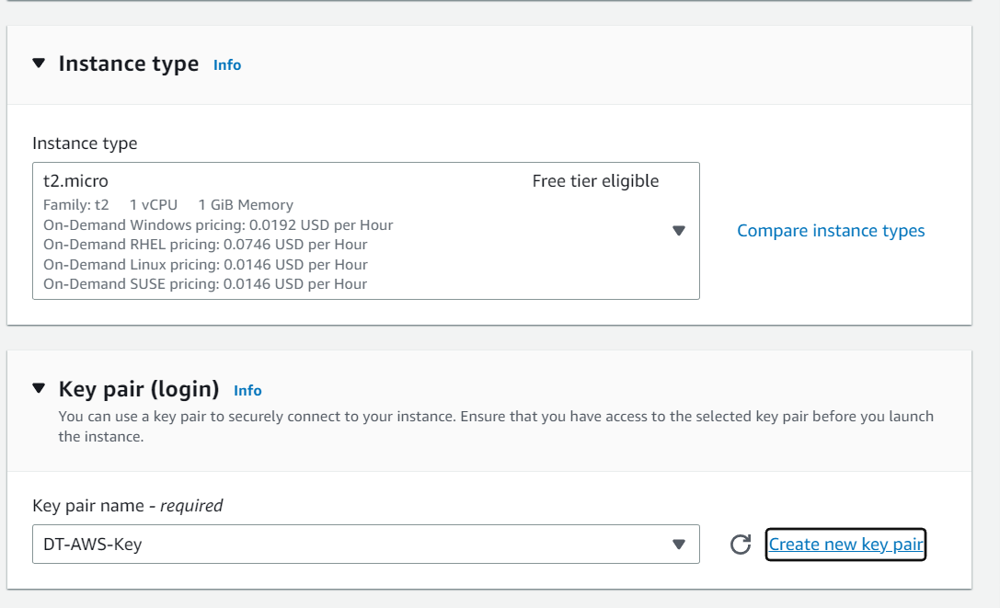

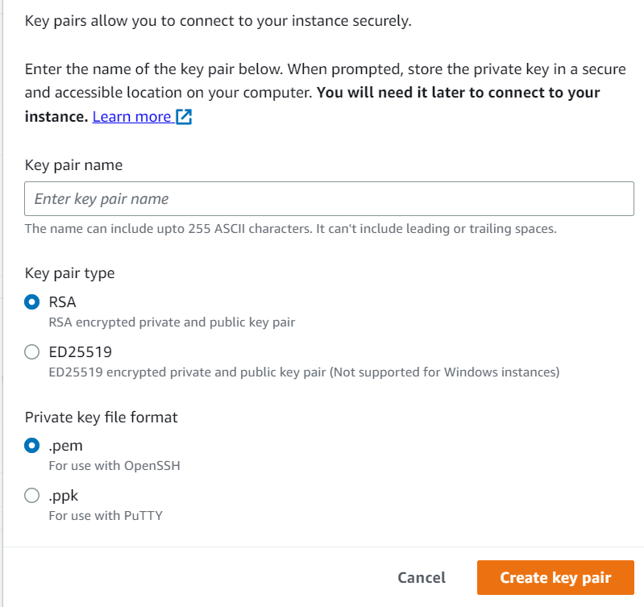

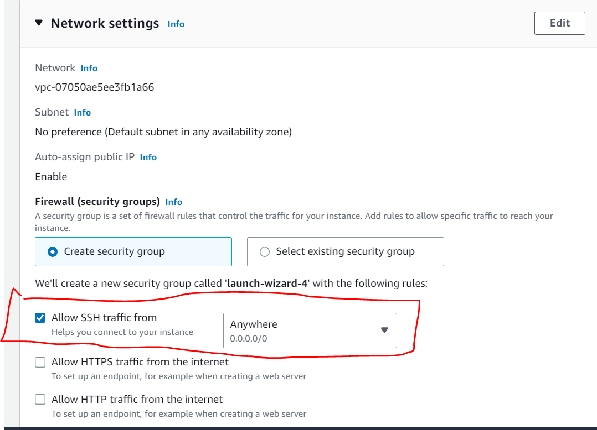

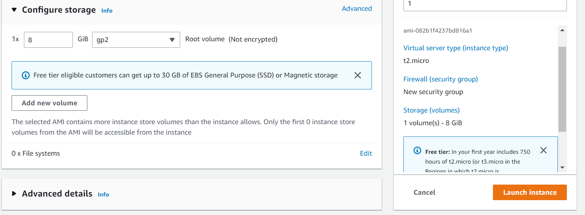

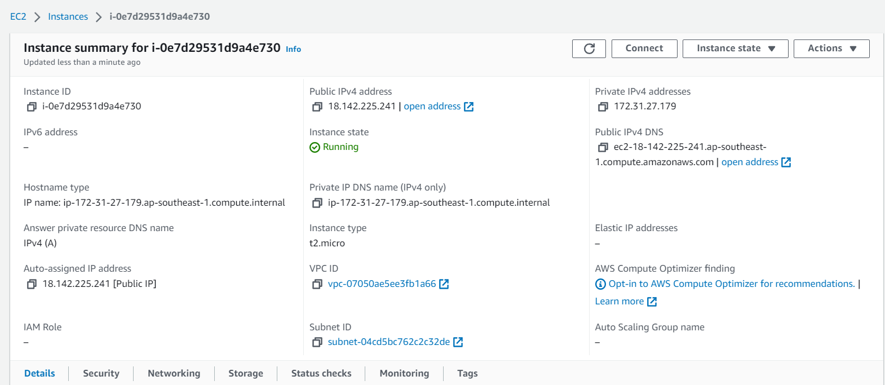

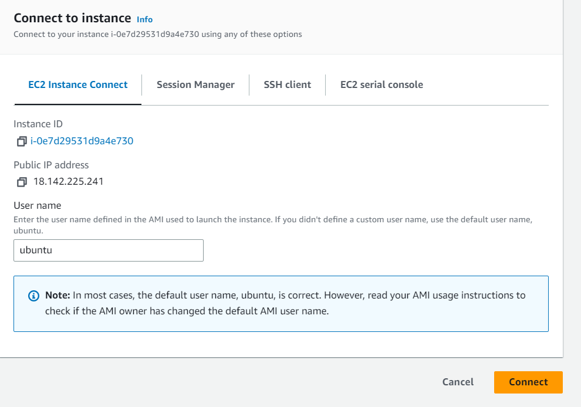

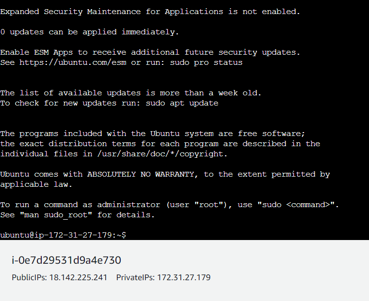

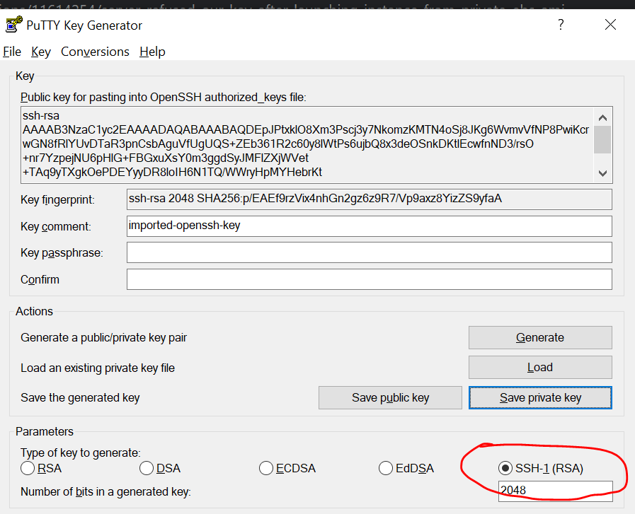

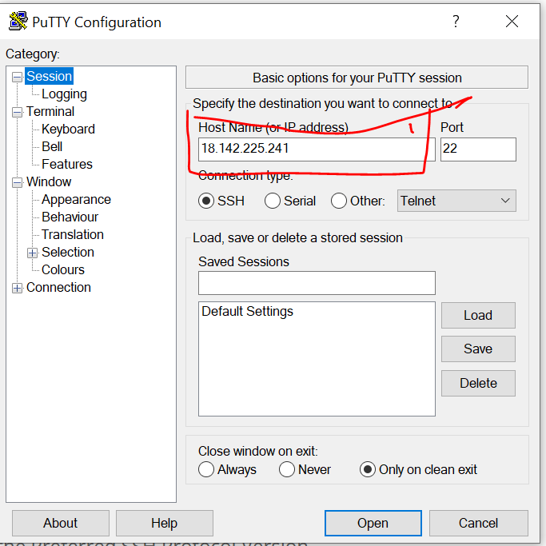

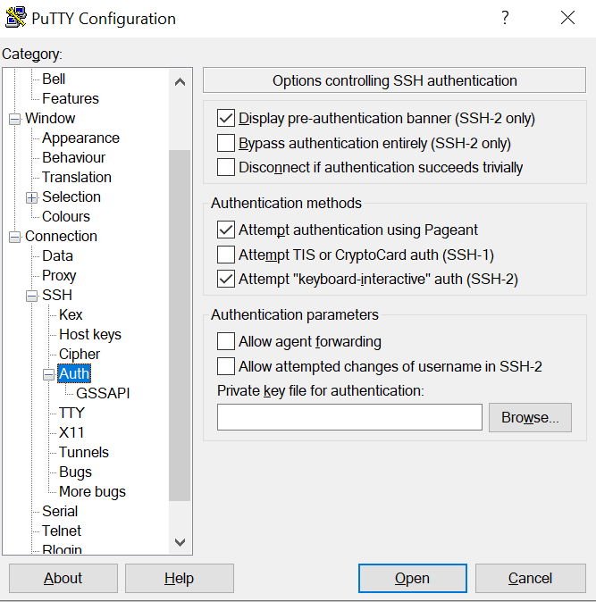

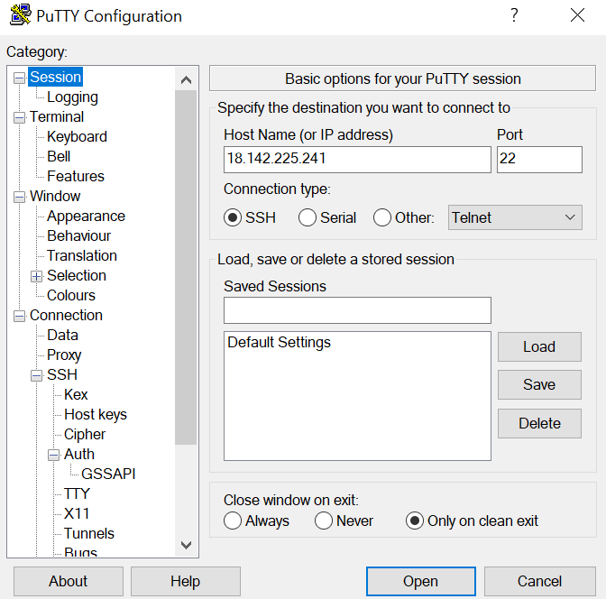

https://www.puttygen.com/
